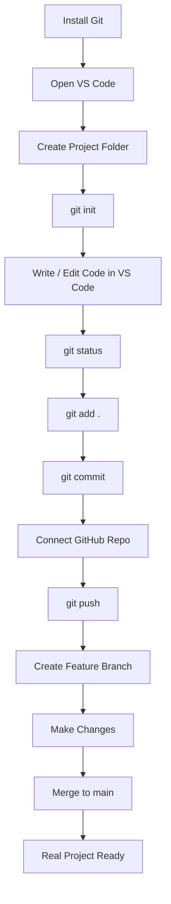
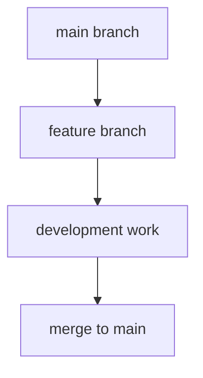
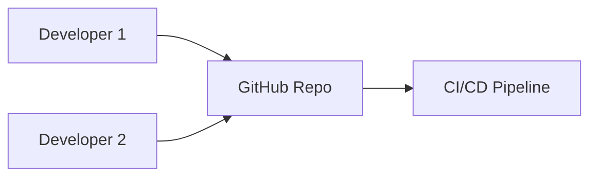
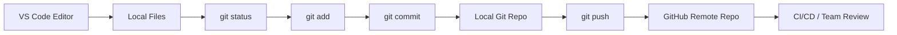

## Git-Importance-in-tech
# 🚀 Git Complete Guide (Beginner to IT/DevOps Ready)

A **simple, practical, and professional Git README** that you can use for learning, interviews, and real IT / DevOps projects.

---

## 📌 What is Git?

**Git** is a **distributed version control system** used to track code changes, collaborate with teams, and manage project versions efficiently.

✅ Used in almost **every IT, DevOps, and software company**

---
mermaid

 
 graph LR
    A[VS Code / Project Files] --> B[git init]
    B --> C[Working Directory]

    C -->|git status| C
    C -->|git add| D[Staging Area]
    D -->|git commit| E[Local Repository]

    E -->|git log| E
    E -->|git branch| F[Feature Branch]
    F -->|git checkout / switch| F
    F -->|git merge| E

    E -->|git remote add origin| G[GitHub Remote Repo]
    E -->|git push| G
    G -->|git pull| E
    G -->|git fetch| E

    E -->|git reset| D
    D -->|git reset| C
    C -->|git clean| H[Clean Working Directory]


## 🧠 Why Git is Important?

* Tracks every change in code
* Enables team collaboration
* Prevents code loss
* Helps rollback to previous versions
* Core requirement for DevOps & CI/CD

---

## ⚙️ Git Basic Setup (One Time)

```bash
git --version
git config --global user.name "Your Name"
git config --global user.email "you@email.com"
```

---

## 📁 Repository Commands

### Initialize Repository

```bash
git init
```

### Clone Repository

```bash
git clone <repo-url>
```

---

## 📝 Daily Used Git Commands (MOST IMPORTANT)

### Check Status

```bash
git status
```

### Add Files to Staging

```bash
git add .
```

### Commit Changes

```bash
git commit -m "commit message"
```

---

## 🌿 Branching Commands

### List Branches

```bash
git branch
```

### Create Branch

```bash
git branch feature-branch
```

### Switch Branch

```bash
git checkout feature-branch
```

### Create & Switch

```bash
git checkout -b new-feature
```

---

## 🔄 Remote Repository Commands

### Add Remote

```bash
git remote add origin <repo-url>
```

### Push Code

```bash
git push origin main
```

### Pull Latest Code

```bash
git pull origin main
```

### Fetch Updates

```bash
git fetch
```

---

## 🔀 Merge & Conflict Handling

### Merge Branch

```bash
git merge feature-branch
```

### Resolve Conflict

```bash
git add .
git commit -m "Resolved merge conflict"
```

---

## ⚔️ Undo & Fix Commands (IMPORTANT)

### View Commit History

```bash
git log --oneline
```

### Unstage File

```bash
git reset filename
```

### Undo Last Commit (Soft)

```bash
git reset --soft HEAD~1
```

### Discard Local Changes

```bash
git checkout -- filename
```

---

## 🧹 Cleanup Commands

### Delete Branch

```bash
git branch -d branch-name
```

### Remove Untracked Files

```bash
git clean -f
```

---

## 📊 My Git Learning Journey (VS Code → Real Project)

This diagram shows **how I personally learned Git step-by-step using VS Code**, from zero to real IT project usage.

### 🧠 How I Learned Git (My Own Workflow)



📌 **Explanation (In My Words):**

* I started by installing Git and using **VS Code** as my main editor
* Initialized Git inside my project (`git init`)
* Learned daily commands while coding
* Connected my local project to **GitHub**
* Used branches for features
* Merged code like real company workflow

---

### 2️⃣ Git Branching & Merging Flow



📌 **Explanation:**

* Main branch stays stable
* Feature branches are used for new changes
* After testing, feature branch is merged

---

### 3️⃣ Git Collaboration Flow (Team Work)



📌 **Explanation:**

* Multiple developers push code
* Central repository manages changes
* CI/CD automates build & deployment

---

## 🔁 Real Company Git Workflow

```bash
git pull origin main
git checkout -b feature-x
# code changes
git add .
git commit -m "Added feature x"
git push origin feature-x
```

---

## 💼 Interview Must-Know Git Commands

* git status
* git add
* git commit
* git push
* git pull
* git branch
* git merge
* git log
* git reset

---

## 📌 Best Practices

* Write meaningful commit messages
* Pull before starting work
* Create separate branches for features
* Never push broken code

---

## ⚙️ Tech View: Git Learning Flow (VS Code → Git → GitHub)

A **clean, technical diagram** showing how I use Git daily while coding in **VS Code**.



📌 **Tech Explanation:**

* Code is written and managed in **VS Code**
* Git tracks changes locally
* Commits create version history
* GitHub stores and shares code
* CI/CD or teammates review & deploy

---

## ⭐ Author

**Arkan Tandel**
🔗 LinkedIn: [https://www.linkedin.com/in/arkantandel](https://www.linkedin.com/in/arkantandel)
🔗 GitHub: [https://github.com/arkantandel](https://github.com/arkantandel)

